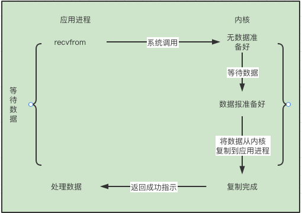

# I/O 复用: select\poll\epoll 初探

Created: March 5, 2022 3:09 PM
Tags: socket, 网络编程

## I/O 模型

数据的读取分为两个阶段：

1. 准备数据
2. 将数据从内核拷贝到进程（用户空间）

对于套接字的输入操作，第一步通常是等待数据从网络中到达，当所有分组到达时，将它复制到内核的某个缓冲区（准备数据）；第二步是把数据从内核缓冲区复制到应用进程缓冲区

### 5种I/O 模型

**阻塞式I/O**



blocking i/o

**非阻塞式I/O**

采用轮训式，一旦内核中数据准备好，便等待数据复制后返回


nonblocking i/o

**I/O复用**

分为两步，采用`select（poll）`函数（阻塞），等待数据报套接字变成可读。当`select`返回这一条件后，再调用 `recvfrom` 函数去读取数据


i/o multiplexing

**信号驱动式I/O**


信号驱动式

**异步I/O**


### 对比

前四种在第二阶段相似，都在等待数据从内核复制到用户进程那里阻塞


5种模型的对比


## `I/O`复用

### `select` 函数

```cpp
int   select(int maxfd1, fd_set * __restrict, fd_set * __restrict,
    fd_set * __restrict, struct timeval * __restrict)
```

### `struct timeval`

```cpp
_STRUCT_TIMEVAL
{
	__darwin_time_t         tv_sec;         /* seconds */
	__darwin_suseconds_t    tv_usec;        /* and microseconds */
};
```

告知内核等待所制定描述符中的任何一个就绪可花费多长时间

这个参数有三种可能：

1. 永远等待下去，有一个描述符准备好后I/O才返回，此时将该 `__restrict` 设置为 null
2. 等待一段固定时间, 有一个描述符准备好后I/O才返回, 等待固定时间（`__restrict`）未收到也直接返回
3. 不等待， 检查描述符后立刻返回，类似于`轮询`的方式 `__restrict` 设置为0

其实第1，3都是第2中的一种特例，区分在于时间的设置

### 中间三个`fd_set`

代表 可读、可写、发生异常三种描述符，都是整数数组。在`select` 函数中可以置为空

异常分为两种

1. 某个套接字的外带数据到达
2. 某个已经设置为分组模式的伪终端存在可从其主端读取的控制状态信息

`fd_set`

是一个`整数数组`，最大可以表示1024个描述符数量，它底层是一个整数数组（int型数组，大小为32个）

```cpp
#define __DARWIN_FD_SETSIZE     1024
#define __DARWIN_NBBY           8                               /* bits in a byte */
#define __DARWIN_NFDBITS        (sizeof(__int32_t) * __DARWIN_NBBY) /* bits per mask */
typedef struct fd_set {
	__int32_t       fds_bits[__DARWIN_howmany(__DARWIN_FD_SETSIZE, __DARWIN_NFDBITS)];
} fd_set;
```

**操作`fd_set`**

主要使用以下宏


```cpp

    fd_set rset;
    // 重置为0
    FD_ZERO(&rset);
    // 设置位置， 最大是1024
    FD_SET(1000, &rset);
    // 判断此位是否设置
    FD_ISSET(1000, &rset);
    // 将该位置位0
    FD_CLR(1000, &rset);
```

**判定条件**


### `maxfd1`

带测试描述符的个数，通常为最大描述符+1

因为，它扫描 `0～maxfd1`  区间的描述符

### `poll` 函数

```cpp
int poll(struct pollfd *, nfds_t, int)

struct pollfd {
	int     fd;
	short   events;
	short   revents;
};

typedef unsigned int nfds_t;
```

从函数可以看出，它于`select`的最大区别在于，它将fd组织成了一个链表，这样突破了1024的限制，理论上是无限的。它将三种事件描述符（可读、可写、异常发生）绑定到每个fd上，

```cpp
struct pollfd {
	int     fd;
	short   events;
	short   revents;
};
```

他将事件分为以下几种，通过判定revents字段来确认是否准备完毕


|  | select | poll |
| --- | --- | --- |
| fd 限制 | 有 FD_SETSIZE (1024/2048) | 无  |
| 获取就绪的监听时间 | O(N) | O(N) |
| 实现结构 | fd_set 三组 | struct pollfd *__fds |

### `epoll` 函数

上面的 select 和 poll 函数均存在各自的问题。

1. `fd` 限制： select 存在 FD_SETSIZE, `1024`
2. 执行时间伴随着监听的`fd`增多而线性增加: 内核中实现 `select`是用轮询方法，即每次检测都会遍历所有FD_SET中的句柄
3. 多次内核拷贝

`epoll` 函数的优点：

1. 支持一个进程打开大数目的socket描述符(FD)

   `epoll`所支持的FD上限是最大可以打开文件的数目，这个数字一般远大于`2048`,举个例子,在`1GB`内存的机器上大约是`10`万左 右，具体数目可以`cat /proc/sys/fs/file-max`察看,一般来说这个数目和系统内存关系很大。

1. IO 效率不随FD数目增加而线性下降

       在内核实现中epoll是根据每个`fd`上面的`callback`函数实现的,只有"活跃"的`socket`才会主动的去调用 `callback`函数，其他`idle`状态`socket`则不会

1. 使用mmap加速内核 与用户空间的消息传递。

       无论是`select`,`poll`还是`epoll`都需要内核把`FD`消息通知给用户空间，如何避免不必要的内存拷贝就 很重要，在这点上，`epoll`是通过内核与用户空间`mmap`同一块内存实现的。     

epoll 分为三种函数

```cpp
// 创建一个 epfd
int epoll_create (int __size);
// Manipulate an epoll instance "epfd"， 向其中增加、修改、删除 事件监听
int epoll_ctl (int __epfd, int __op, int __fd, struct epoll_event *__event)
// Wait for events on an epoll instance "epfd"
// Returns the number of triggered events returned in "events" buffer
int epoll_wait (int __epfd, struct epoll_event *__events, int __maxevents, int __timeout)
```

一种典型的用法

参考 [[github]](https://github.com/codeflysafe/computer-network/blob/main/src/socket_c/epoll_socket/epoll_client.c)

```cpp
/*
 * @Author: sjhuang
 * @Date: 2022-03-06 13:31:08
 * @LastEditTime: 2022-03-06 13:43:56
 * @FilePath: /computer_network/src/socket_c/epoll_socket/epoll_client.c
 */
#include "epoll_socket.h"
int main(){

    // epoll fd 和 socket fd
    int epfd, sockfd;
    int max_epoll_size = 5, nready, n;
    pid_t  pid = getpid();
    char buf[BUF_SIZE];
    // 创建 socket fd
    sockfd = socket(AF_INET, SOCK_STREAM ,IPPROTO_TCP);

    // 创建 server socket adder
    struct sockaddr_in server_addr;
    memset(&server_addr, 0, sizeof(server_addr));
    server_addr.sin_family = AF_INET;
    server_addr.sin_port = ntohs(SERVER_PORT);
    server_addr.sin_addr.s_addr = inet_addr(SERVER_IP);

    // 创建一个 epoll fd
    epfd = epoll_create(max_epoll_size);
    // epoll event
    // ev 用于注册时间， event 用以接收准备好的时间
    struct epoll_event ev, events[max_epoll_size];
    // 注册监听事件
    ev.fd = sockfd;
    ev.events = EPOLLIN;

    // 向内核中注册事件监听
    epoll_ctl(epfd, EPOLL_CTL_ADD, sockfd, &ev);
    nready = epoll_wait(epfd, events,max_epoll_size, -1);
    for(int i = 0; i < nready; i++){
        // 可读
        if(events[i].fd == sockfd && events[i].events & EPOLLIN){
            n = read(sockfd, buf, BUF_SIZE);
            if(n > 0){
                printf("[Client] %d received from server msg: %s\n", pid, buf);
            }
        }
    }

    // 关闭 socket 套接字
    close(sockfd);

    return 0; 
}
```

## References

[UNIX网络编程 卷1：套接字联网API（第3版）](https://book.douban.com/subject/4859464/)

[linux select函数详解](https://www.cnblogs.com/alantu2018/p/8612722.html)

[Linux IO模式及 select、poll、epoll详解](https://segmentfault.com/a/1190000003063859)

[Epoll模型详解-lvyilong316-ChinaUnix博客](http://blog.chinaunix.net/uid-28541347-id-4232252.html)